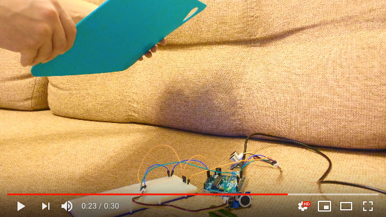
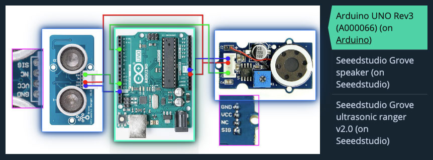

# RANGIANO
Arduino based instrument for playing melodies by changing distance  

Demo video:  
[](https://www.youtube.com/watch?v=7qSYFnmITL8)  

## Used components
1. Arduino UNO Rev3
2. Seeedstudio Grove ultrasonic ranger v2.0
3. Seeedstudio Grove speaker v1.1

[](https://www.descr.be/posts/37/?utm_source=gthb&utm_medium=or&utm_campaign=awabys&utm_content=poli&utm_term=them)   

*[Wiring scheme with links to components](https://www.descr.be/posts/37/?utm_source=gthb&utm_medium=or&utm_campaign=awabys&utm_content=poli&utm_term=them) and [actual photo of assembled project](https://www.descr.be/posts/36/?utm_source=gthb&utm_medium=or&utm_campaign=awabys&utm_content=poli&utm_term=them) at DESCRiBE*  

## Usage
- Clone project:
`git clone https://github.com/efojs/rangiano.git` or copy code to your sketch

- Connect sensor and speaker to pins `12` and `3` accordingly (or set yours in `rangiano.ino`)

In `melody.h`:  
- Choose or write melody following this pattern:
```
[ note + number of octave + _N ] ==> C4_N == piano middle C
```

In `rangiano.ino`:
- Set working range in centimetres:
```
#define FAR 40
#define MINDIST 5  
```
- Set direction of playing (default: played by approaching sensor):
```
// #define GOAWAY true   // to play by moving away from sensor
```
- Set method of playing (default: using `tone()` method):
```
// #define GENERATE true  // to play by digitalWrite() and delay(): with pause, but more realiable
```

## How it works
**Our goal is to play melody note by note:**  
- Melody is set as an array of notes in `melody.h`
Notes are defined by respective frequencies in `notes_frequencies.h`  
```
const float notes[] = { C4_N, D4_N, E4_N, F4_N, G4_N, A4_N, B4_N, C5_N };
```
- Every note in array has its own index (from 0 to N)
- We will divide working range into subranges by number of notes in melody — steps
- Then play note corresponding to the index of step of current location

### Technically
Ranger measures distance from 3 to 350 cm ==> `cm`    
Then we check if it is in the working range.
```
               |<-------- working range -------->|
               |                                 |
  |____________|=================================|___________|
  |           NEAR          |                   FAR          |
  |                         |                                |
  3 cm                      cm                              350 cm
```
If `cm` is in range, we find index of current step (depending on direction of playing).  
By default we play by approaching sensor.  
So divide distance from `FAR` to `cm` by `noteStep`, e.g.:
```
cm =       124
FAR =  170
noteStep =  25

int index = (170 - 124)/25 ==> 1.84 ==> 1  // not rounding

--  
                  cm    
        NEAR       |    FAR
         |         |     |
steps:   | 3 | 2 | 1 | 0 |
                  /
                 /
                /               
notes:   | C | D | E | F |
```

Then pass `index` to player method, either:  
- one using builtin `tone()` method, or
- one generating sound.

## Known issues
- `tone()` somehow disturbs sensor at about 150 cm
- not yet sure if it's possible to use `generateSound()` method without pause for measure

## Contribute
Will be great if you add features or fix something (e.g. this readme) by making a pull request or raising an issue.


## Disclaimer
This project is made for educational purposes.  
Be careful working with electricity.  
Code provided as is and no warranty applied — so be careful and check everything before usage — I can not be responsible for any damage caused by your usage of this code.

## Licence
Some code or concepts used from these Arduino tutorial:
- [Ping Ultrasonic Range Finder](https://www.arduino.cc/en/Tutorial/Ping) — thanks to David A. Mellis and Tom Igoe;
- [Play a Melody using the tone() function](https://www.arduino.cc/en/Tutorial/ToneMelody) — thanks to Tom Igoe.

Rangiano is released under the MIT License.
