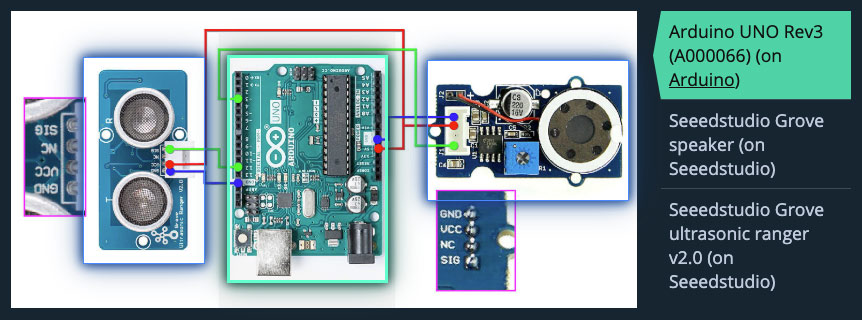

# RANGIANO
Arduino based instrument for playing melodies by changing distance

## Used components
1. Arduino UNO Rev3
2. Seeedstudio Grove ultrasonic ranger v2.0
3. Seeedstudio Grove speaker v1.1

Check wiring scheme with links to components at [Descr!be](https://www.descr.be/posts/36/?utm_source=gthb&utm_medium=or&utm_campaign=awabys&utm_content=poli&utm_term=them):  

  

## Usage
Clone project:
`git clone https://github.com/efojs/rangiano.git` or copy code from to your project

Connect sensor and speaker to pins `12` and `3` accordingly (or set yours in `rangiano.ino`)

In `melody.h`:  
- Set melody following this pattern:
```
[ note + number of octave + _N ] ==> C4_N == piano middle C
```

In `rangiano.ino`:
- Set working range in centimetres:
```
#define MAXDIST 40
#define MINDIST 5  
```
- Set direction of playing (default: played by approaching sensor):
```
// #define GOAWAY true   // to play by moving away from sensor
```
- Set method of playing (default: using `tone()` method):
```
// #define GENERATE true  // to play by digitalWrite() and delay(): with pause, but more realiable
```

## How it works
Melody is set as an array of notes in `melody.h`. Notes are defined by respective frequencies in `notes_frequencies.h`  
```
const float notes[] = { C4_N, D4_N, E4_N, F4_N, G4_N, A4_N, B4_N, C5_N };
```

**Our goal is to play melody note by note**  
Every note in array has its own index  
**=> We will divide working range into steps by number of notes in melody**  
Then play note corresponding to the index of current step  

Ranger measures distance from 3 to 350 cm ==> `cm`    
Then we check if it is in the working range.
```
               |<-------- working range -------->|
               |                                 |
  |____________|=================================|___________|
  |         MINDIST         |                 MAXDIST        |
  |                         |                                |
  3 cm                      cm                              350 cm
```
If `cm` is in range, we find index of current step (depending on direction of playing).  
By default we play by approaching sensor.  
So divide distance from `MAXDIST` to `cm` by `noteStep`.
```
cm =       124
MAXDIST =  170
noteStep =  25

int index = (170 - 124)/25 ==> 1.84 ==> 1  // not rounding

--  
        near      cm    far
         |         |     |
steps:   | 3 | 2 | 1 | 0 |
                ___|
               |               
notes:   | C | D | E | F |
```

Then pass `index` to player method, either:  
- one using builtin `tone()` method, or
- one generating sound.

## Known issues
- `tone()` somehow disturbs sensor at about 150 cm
- not yet sure if it's possible to use `generateSound()` method without pause for measure

## Contribute
Will be great if you add features or fix something (e.g. this readme) by making pull request or just raise an issue.


## Disclaimer
This project is made for educational purposes.  
Be careful working with electricity.  
Code provided as is and no warranty applied — so be careful and check everything before usage — I can not be responsible for any damage caused by your usage of this code.

## Licence
Project is based on one from Arduino: https://www.arduino.cc/en/Tutorial/Ping  
So check their licence.  

Feel free to use my part of code, or parts of it.  
If you will use it commercially — remember melodies may be copyrighted.
